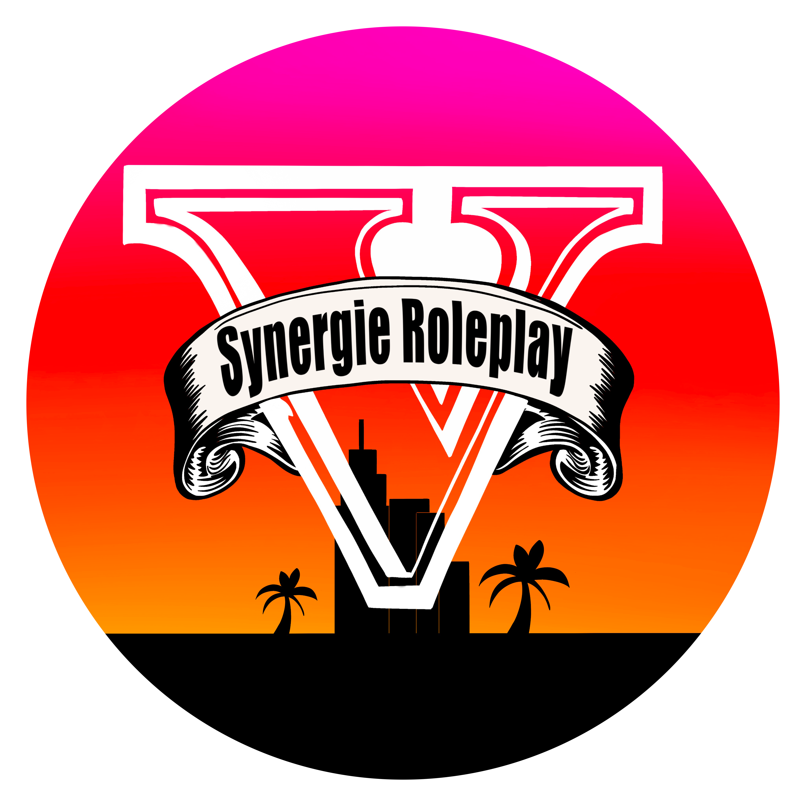

# SynergiaBot

<p align="center">
  
</p>

SynergiaBot est un Bot Discord développé en Python à l'aide de la librairie [**Discord.py**](https://discordpy.readthedocs.io/en/latest/index.html)
et permettant de réaliser de nombreuses actions sur le serveur Discord de [Synergie Roleplay](https://github.com/Drmarsupial35/Synergie-Roleplay).


## Fonctionnalités proposées

- Affectation automatique de rôles (A l'arrivé sur le serveur et lors de l'ajout de réaction sur un message)
- Ouverture et fermeture automatique de salons (textuels et vocaux)
- Système de tickets (Dans le même style que le Bot [**Ticket Tool**](https://tickettool.xyz/))
- Système de logs des messages, afin de retouver des messages supprimés (Sauvegarde de la date et l'heure exacte du message, du salon dans lequel il a été écrit et le nom de l'auteur sur le serveur)
- Création de messages **Embed** (*voir les exemples ci-dessous*)
- Ajout de réactions à des messages

## Lancement

```shell
python3 FiveM_Bot.py
```

## Exemples

Liste des commandes disponibles par le Bot :
<p align="center">
  
</p>

Exemple de message **Embed** (Ici, un message indiquant aux utilisateurs le fonctionnement du salon **Sugestion**) :
<p align="center">
  
</p>

Message permettant d'ouvrir un ticket :
<p align="center">
  
</p>
